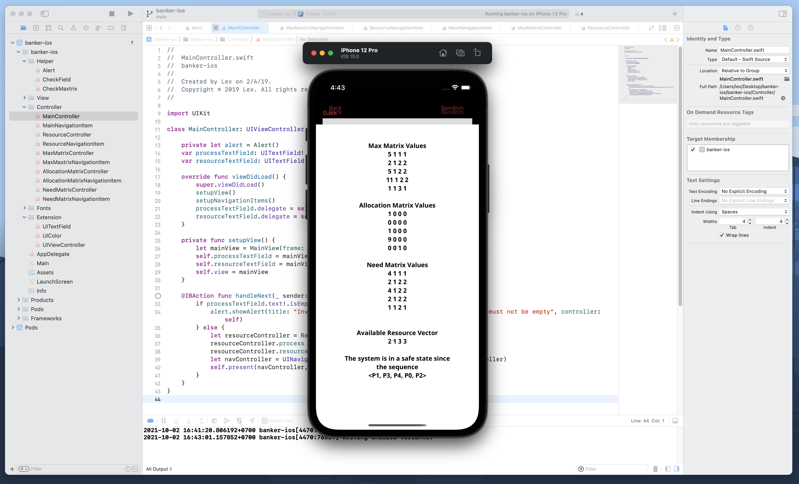

# banker-ios

Banker's Algorithm Simulation in mobile app.

## Banker’s Algorithm in Operating System

The [banker’s algorithm ](https://www.geeksforgeeks.org/bankers-algorithm-in-operating-system-2/)is a resource allocation and deadlock avoidance algorithm that tests for safety by simulating the allocation for predetermined maximum possible amounts of all resources, then makes an “s-state” check to test for possible activities, before deciding whether allocation should be allowed to continue.

 

## Simulation in mobile app

